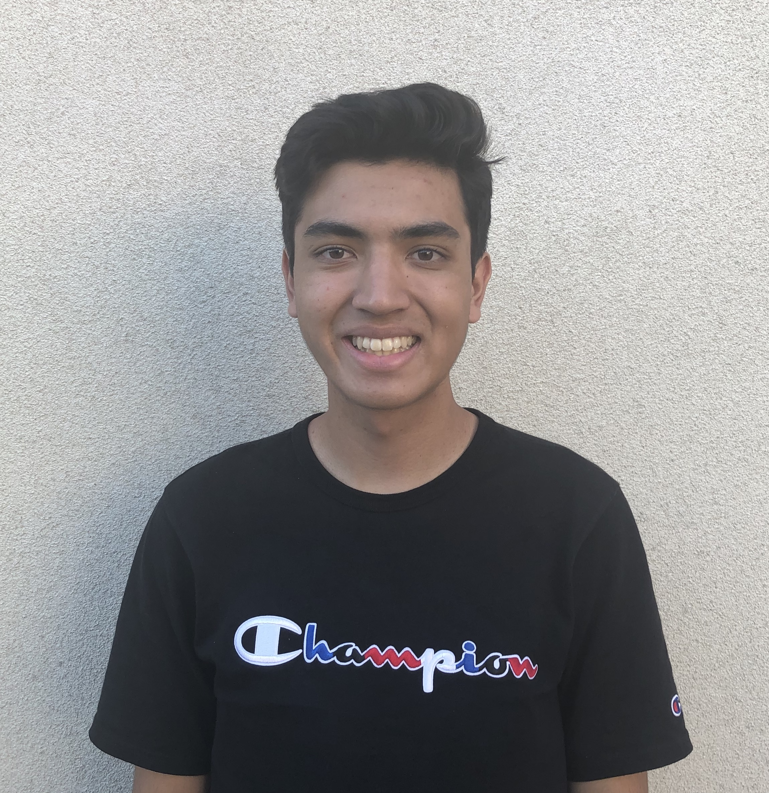

# Hello!
**Hi my name is Gary! :)**

`std::cout << "Hello World!";`

> 

I'm currently a second-year Computer Science major at [UCSD](https://ucsd.edu/). I like to play video games (A lot of FPS), basketball, and pretty much any type of game you can find. Right now I have been trying to work towards creating meaningful projects I enjoy to hopefully eventually lead to an internship. 

## Projects
> *Sadly I have no remarkable projects yet :(. This will be populated more eventually...*

- [x] Pokemon Generator
  - Participated in workshop where we created a Pokemon creator website using the MERN stack. 
- [ ] ~~TBD~~

## Skills
- Proficient
  - Java
  - C++
  - C
- Basic 
  - HTML
  - CSS
  - Javascript
  
  

[Back to Top](#hello)
